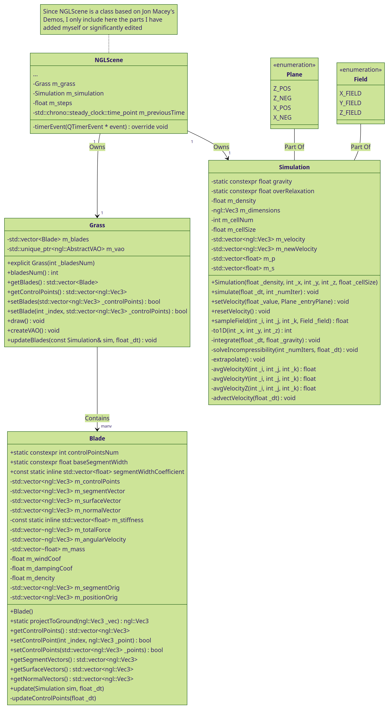
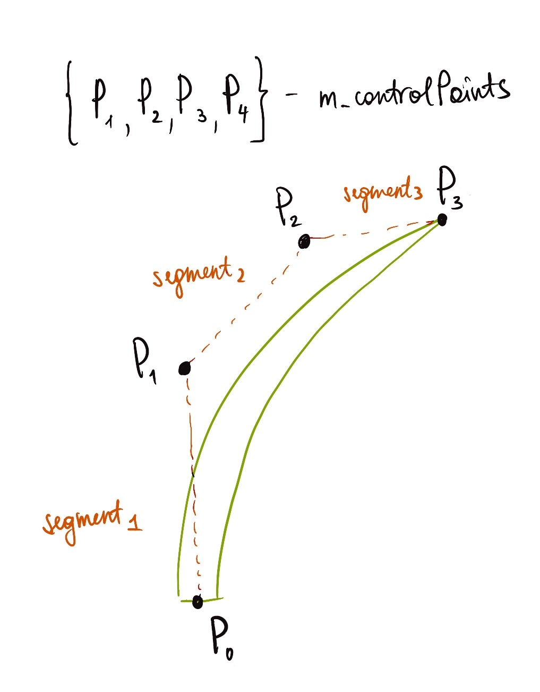
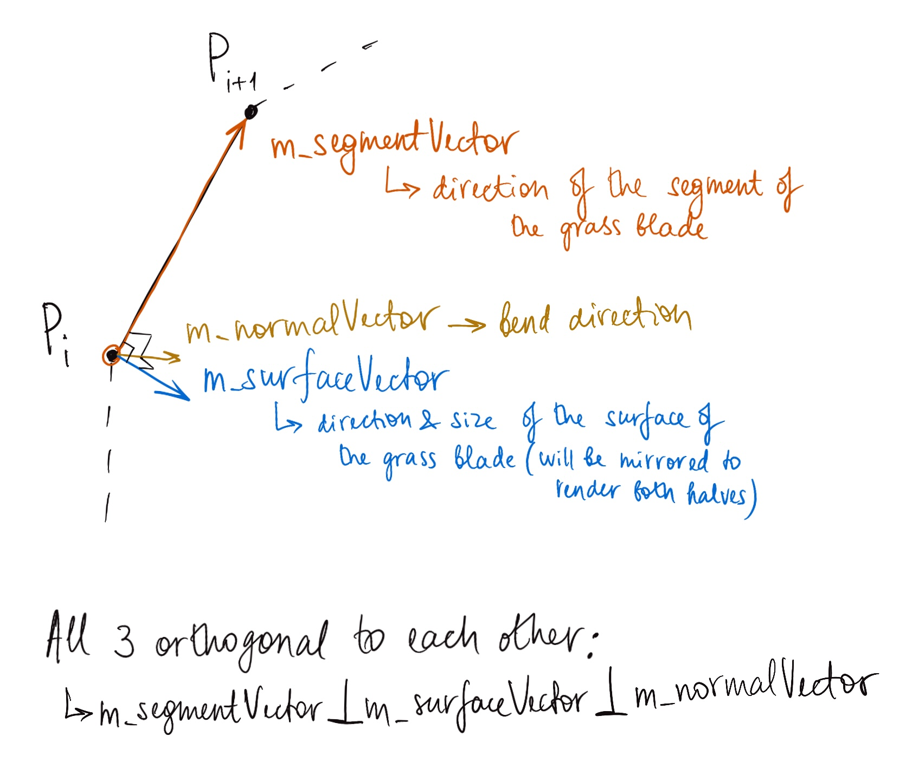
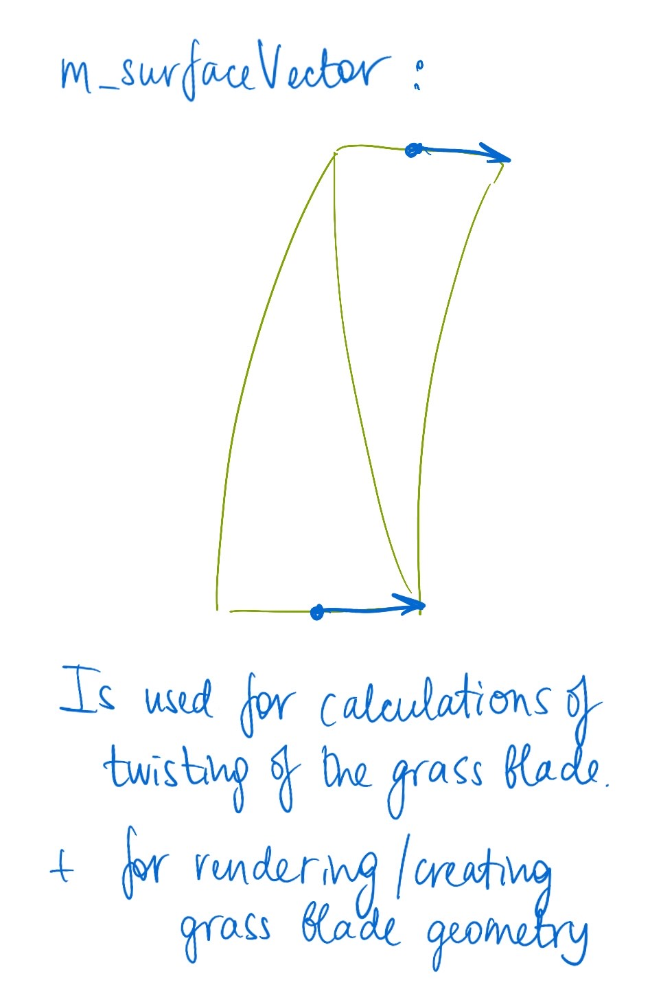
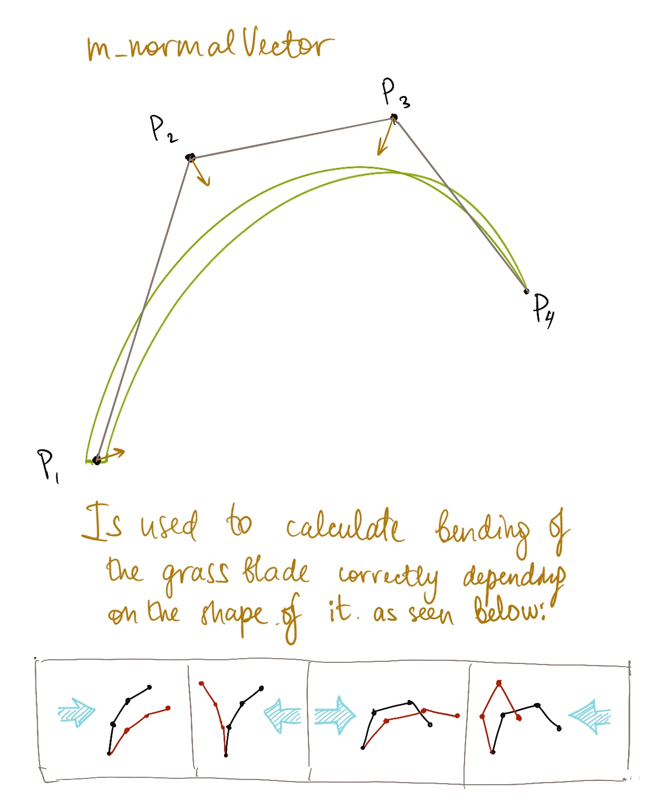
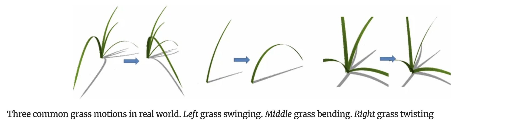

# Design Documents

## Class Diagram

There are multiple blocks of classes responsible for different parts of the program:
1. #### Data Representation
   - the two main classes representing objects in the scene are `Blade` and `Grass`
     - `Grass` is a wrapper class for manipulating multiple glass`Blade`'s at once. The problem I see with just using vectors of `Blade`s on their own is the checks that need to be done on them to ensure data integrity as well as functions that would need to be repeated on vectors of `Blade`s a lot.
   - Inside itself `Grass` is using `Blade` class to hold information about each individual grass blade.
     - `Blade` hold the control points needed to construct a single strand of Grass as well as orientation vectors needed to manipulate and render it.
     - The dynamics of the grass are also executed on an individual blade in `Blade` class. This happens in the [update()](https://github.com/NCCA/ase-assignment-daria-tolmacheva/blob/main/src/Blade.cpp#L100) function.
2. #### Math (aka Simulation)
   - `Simulation` class holds all the information needed for the mathematics of solving fluid dynamics of the wind.
   - This includes both various coefficients and the execution of the physics formulae.
   - The main simulation execution is triggered by [simulate()](https://github.com/NCCA/ase-assignment-daria-tolmacheva/blob/main/src/Simulation.cpp#L330) function, which executed the necessary steps in order. 
3. #### Visualisation
   - For visualization I use an NGLScene class which implements all the necessary components for creating a window running a graphics app.
   - NGLScene contains one instance of each `Grass` and `Simulation` and uses them to update both on a timer and draw them.
   - It also attached shaders to the program, specifically the [geometry shader](https://github.com/NCCA/ase-assignment-daria-tolmacheva/blob/main/shaders/grassGeometry.glsl#L15) computed the grass blade Bezier curve.

## Simulation loop

The simulation loop sequence is executed in the following order:
1. [`NGLScene::timerEvent()`](https://github.com/NCCA/ase-assignment-daria-tolmacheva/blob/main/src/NGLScene.cpp#L198) is triggered.
   1. [`Simulation::simulate()`](https://github.com/NCCA/ase-assignment-daria-tolmacheva/blob/main/src/Simulation.cpp#L330) is called. During this process the valued of pressure and velocity of the wind are stored privately.
      1. Gravity is applied to the vertical velocity.
      2. Pressure is cleared to 0.
      3. Incompressibility is solved.
      4. Values are extrapolated to fill in the edges(padding).
      5. Velocity advected.
   2. [`Grass::updateBlades()`](https://github.com/NCCA/ase-assignment-daria-tolmacheva/blob/main/src/Grass.cpp#L128) is called.
      1. [`Blade::update`](https://github.com/NCCA/ase-assignment-daria-tolmacheva/blob/main/src/Blade.cpp#L100) is called for each blade stored in the `Grass` object.
         1. Total force and angular velocity on each control point of the blade is calculated.
         2. [`Blade::updateControlPoints`](https://github.com/NCCA/ase-assignment-daria-tolmacheva/blob/main/src/Blade.cpp#L250) is called to update control points' positions.
   3. `NGLScene::update()` is called to trigger drawing functions and update the visuals in the window.

## Grass Representation

Each grass blade is represented by the 4 control points of a Bezier curve, and each grass plant consists of multiple grass blades starting in the same point.
The `Blade` class represents a single grass blade and hold information relevant to the Bezier curve which represents it as well as any other information relevant to the deformation calculation of it (e.i. orientation vectors of blade segments).

The `Grass` class needs to include a vector of `Blade` instances to hold the information about all of the grass in the scene(or part of the scene of LOD techniques would be implemented).

The vectors stored in the `Blade` that describe each of the 3 segments of the blade each are:
- `m_segmentVector`, which connects 2 adjescent control points and describes direction of the segment;
- `m_surfaceVector`, which is perpendicular to the segment vector and describes the direction and size of the surface of a half of the grass blade (second half being mirrored) as shown below;
- `m_normal_vector`, which is a unit vector orthogonal to the other two and describes the bend direction used for calculation of bending of the grass blade.

## Grass Dynamics

The implementation of the grass dynamics follows the method described in section 5.2 of "A simulation on grass swaying with dynamic wind force" (2016, https://link.springer.com/article/10.1007/s00371-016-1263-7#Sec5). However, while they implement three grass motions: swaying, bending and tilting, due to time constraints I have only implemented the first two.
Below are some images from this paper to illustrate this.

The forces acting on the grass are the external wind force, causing the main motion, as well as intrinsic restoration force and damping force, representing the oscillating pattern in which the grass tends to restore to its original shape.

External wind force:
$$W = S \sigma \overrightarrow{v}$$
where $S$ is the area of the thrust surface of wind, $\sigma$ is the drag coefficient, and $\overrightarrow{v}$ is the wind velocity.  

Intrinsic restoration force:
$$R = k \bigtriangleup\theta \bigtriangleup \overrightarrow{s}$$
where $k$ is the stiffness coefficient, $\bigtriangleup\theta$ is the angular displacement, and  $\bigtriangleup \overrightarrow{s}$ is the normalized vector from the current position to the static position that captures the grass motion.

Damping force:
$$D = -c \overrightarrow{\omega}$$
where $c$ is the grass damping coefficient and $\overrightarrow{\omega}$ is the angular velocity.

So the total force on grass:
$$F = W + R + D$$

To preserve the structural integrity of the grass blade the forces are calculated on the tip of the blade and then propagated throughout the whole curve. For bending motion this means we need to split the curve in two for calculation and consider two local tips in the case where the grass blade fully bends and normal vectors at control points have opposite vertical direction.