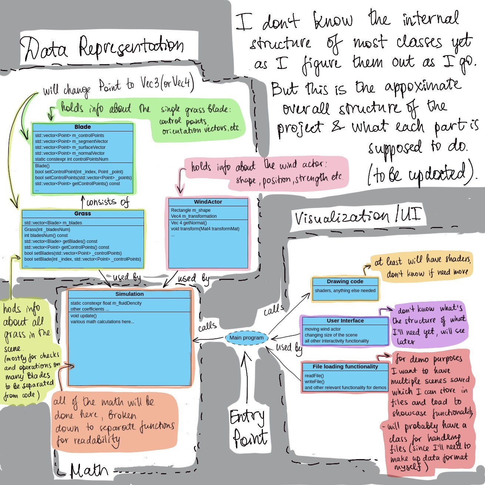

# Design Documents

## Class Diagram

This is provisional diagram, as I don't know the internal structure of most classes yet so it will be updated as I go and understand what I need implemented.

There are multiple blocks of classes responsible for different parts of the program:
1. #### Data Representation
   - the two main objects in the scene are `WindActor` and `Grass`
     - `WindActor` holds information about the wind source including its shape, position and orientation (as a transformation matrix?), strength etc.
     - `Grass` is a wrapper class for manipulation multiple glass`Blade`'s at once. The problem I see with just using vectors of `Blade`s on their own is the checks that need to be done on them to ensure data integrity as well as functions that would need to be repeated on vectors of `Blade`s a lot.
   - Inside itself `Grass` is using `Blade` class to hold information about each individual grass blade.
     - `Blade` hold the control points needed to construct a single strand of Grass as well as orientation vectors needed to manipulate and render it.
2. #### Math (aka Simulation)
   - `Simulation` class will hold all the information needed for the mathematics of solving fluid dynamics of the wind and deformation of the grass.
   - This includes both various coefficients and the execution of the physics formulae divided into separate functions for readability.
   - Depending on how it goes I might split this class into a more logical structure of smaller classes.
3. #### Visualisation/UI
   - This part holds together everything outside the simulation itself, needed for the project:
     - Code relevant for _**drawing**_ (shaders and potentially anything else needed);
     - _**User Interface**_ (including simulation controls);
     - **_File loading_** functionality to save/load scenes for demo purposes.

I will update this design as I iterate through the implementation.