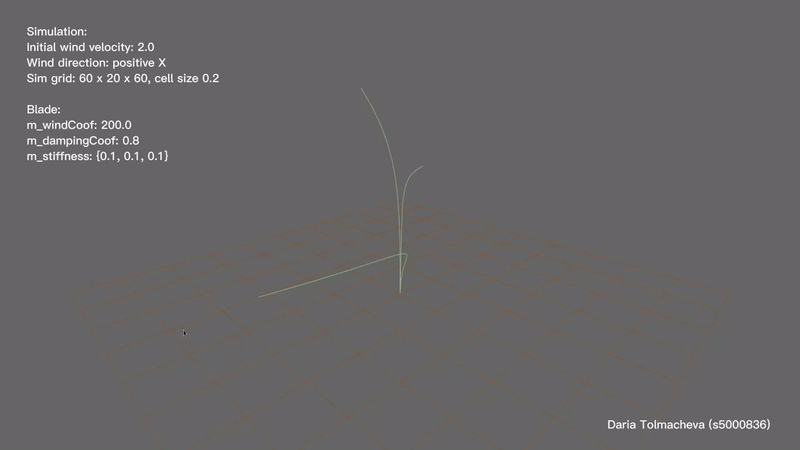

# Real-Time Vegetation Simulation (WIP)

## Overview

For this project I have implemented a real time simulation of grass swaying in the wind, largely based on  "A simulation on grass swaying with dynamic wind force" (2016, https://link.springer.com/article/10.1007/s00371-016-1263-7).
This is a work in progress and needs multiple improvements before being considered complete.

## To Do
1. Implement a GUI or keyboard controls to change simulation settings.
2. Tessellation and geometry shader generating a triangle strip result.
3. Third grass motion implementation in accordance with the solution suggested in a paper.
4. (?) Performance improvements including GPU fluid dynamics.

## Example output

## Running instructions
This project depends on `NCCA NGL Library`, so please first make sure that all of the dependancies for it are resolved and it works in your environment.

Before running make sure that the `GrassSimulation` build is configured to run `GrassSimulationCopyShaders` target before launch.

Unfortunately there are currently no controls implemented. In order to change the values variables need to be modified in code. Here is the list of things that can be changed and where(you can follow the link to GitHub by clicking the code snippet):
- Air density, simulation grid dimensions and single cell size - [`NGLScene.cpp#L14 - m_simulation(_density, _x, _y, _z, _cellSize)`](https://github.com/NCCA/ase-assignment-daria-tolmacheva/blob/main/src/NGLScene.cpp#L14)
- Wind velocity and direction (X_POS, Z_POS, X_NEG or Z_NEG) - [`NGLScene.cpp#L16 - m_simulation.setVelocity(_velocity, _direction);`](https://github.com/NCCA/ase-assignment-daria-tolmacheva/blob/main/src/NGLScene.cpp#L16)
- Fluid dynamics over relaxation (should be between 1 and 2) - [`Simulation.h#L47 - overRelaxation = _coef`](https://github.com/NCCA/ase-assignment-daria-tolmacheva/blob/main/include/Simulation.h#L47)
- Grass dencity - [`Blade.cpp#L10 - m_dencity = _dencity`](https://github.com/NCCA/ase-assignment-daria-tolmacheva/blob/main/src/Blade.cpp#L10)
- Wind force coefficient - [`Blade.cpp#L9 - m_windCoof = _coef`](https://github.com/NCCA/ase-assignment-daria-tolmacheva/blob/main/src/Blade.cpp#L9)
- Damping force coefficient - [`Blade.cpp#L11 - m_dampingCoof = _coef`](https://github.com/NCCA/ase-assignment-daria-tolmacheva/blob/main/src/Blade.cpp#L11)
- Segment stiffness coefficient - [`Blade.h#L39 - m_stiffness = {_bottomSeg, _midSeg, _topSeg}`](https://github.com/NCCA/ase-assignment-daria-tolmacheva/blob/main/include/Blade.h#L39)

The current hard coded values make the frame rate quite slow and the quality of the animation jagged, however this is the best set of parameters in terms of resulting grass motion form out of the limited set of experiments I've tried, so for purposes of the default I have settled for them for now despite lower frame rate.

## Speed Concerns

Currently the project needs to be refactored to optimise the performance. While this may include computing the fluid simulation on GPU via a compute shader, I should refactor the way OpenGL buffers are handled to perhaps store control points directly in a vector in `Grass`. Similarly, I need to go over the code and make sure to pass parameters by reference where needed to avoid copying large vectors.

## Notes

Please refer to [`Design.md` file](https://github.com/NCCA/ase-assignment-daria-tolmacheva/blob/main/Design.md) for mode details of the design decisions and explanations of implementation, as well as [`Plan.md` file](https://github.com/NCCA/ase-assignment-daria-tolmacheva/blob/main/Plan.md) for my progress log throughout the project duration.
